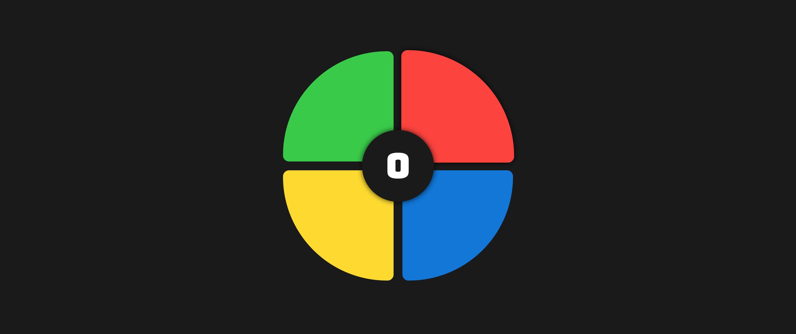

> This project was bootstrapped with [Create React App](https://github.com/facebookincubator/create-react-app).

# React Simon Says



### Quick Start

```
$ git clone https://github.com/topdev17/react-redux-game.git
$ cd react-redux-game
$ npm install
$ npm start
```

### Specs

I am using [Jest](https://facebook.github.io/jest/) as my spec runner, you can run it using:

```
$ npm test
```

and to get a coverage overview:

```
$ npm test -- --coverage
```
